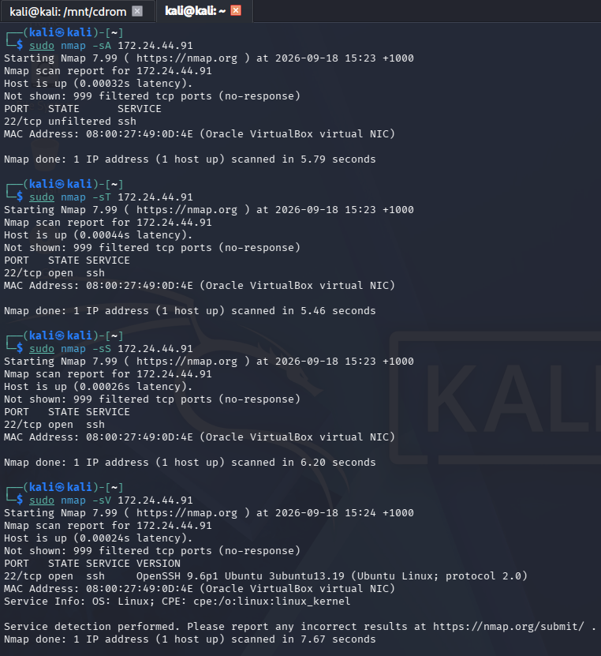
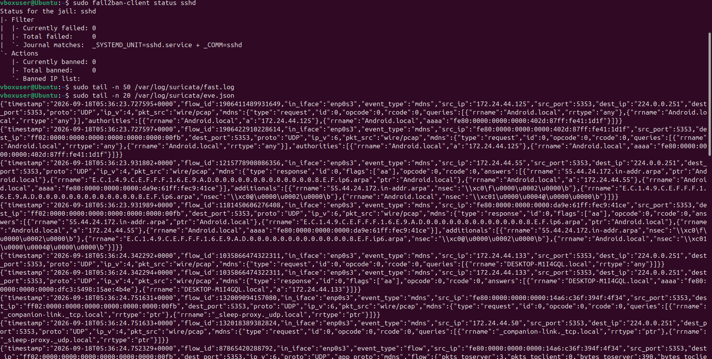
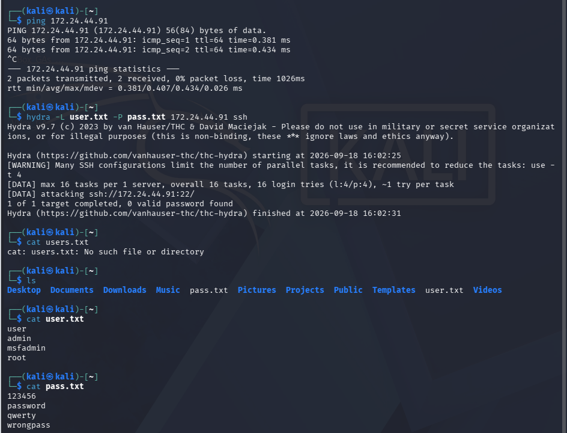
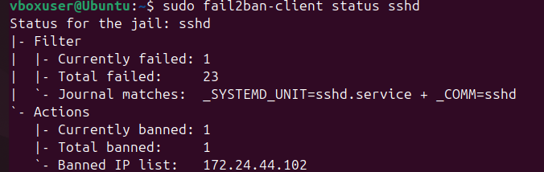
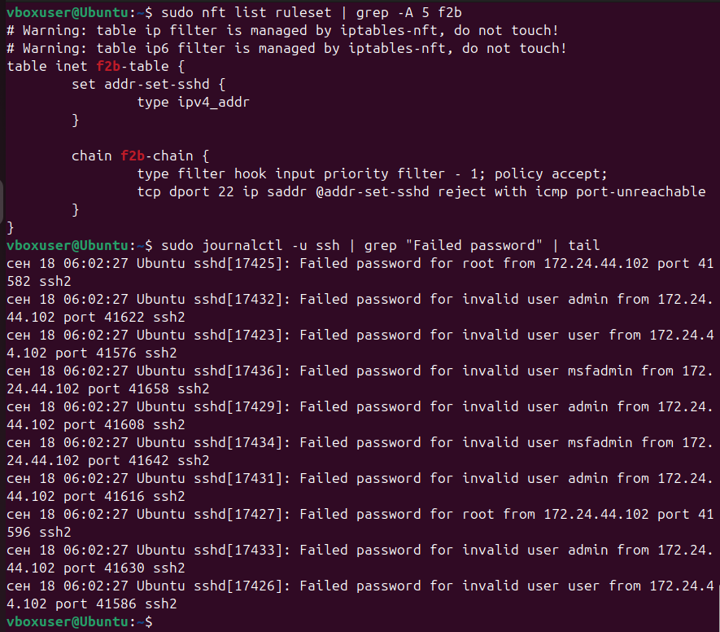
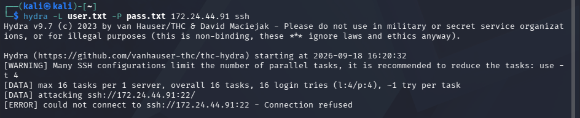

# Домашнее задание к занятию "Защита сети" - `Филиппов К.П`

---

### Задание 1

Suricata зафиксировала сканирование. Fail2Ban не сработал, так как сканирование портов не является попыткой аутентификации
eve.json приложен в репозитории

---

### Задание 2

Fail2Ban обнаружил серию неудачных SSH-аутентификаций от IP 172.24.44.102 (Kali). После 3 попыток (порог maxretry) IP был автоматически забанен на 600 секунд. Повторные попытки подключения блокируются на уровне nftables

 

---

